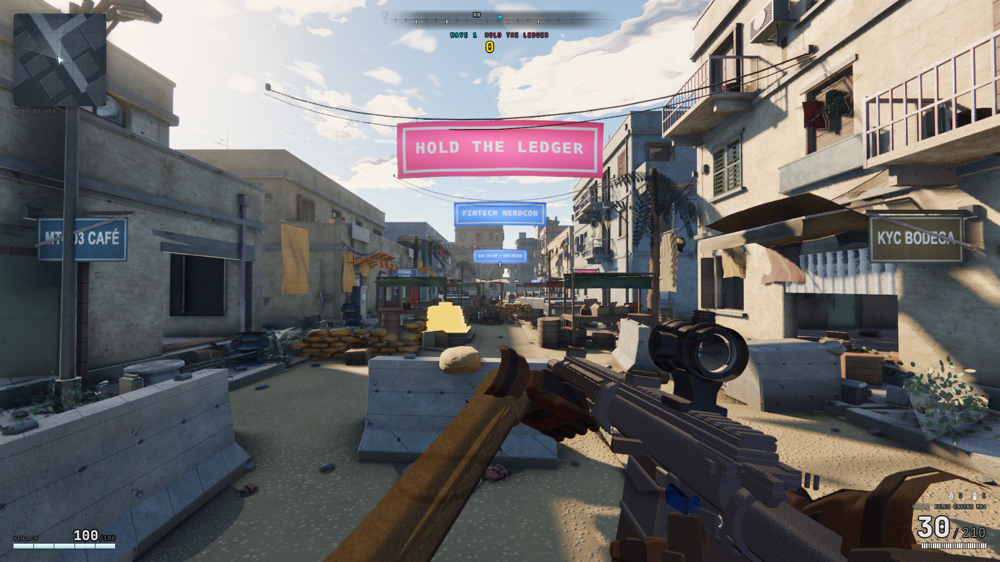
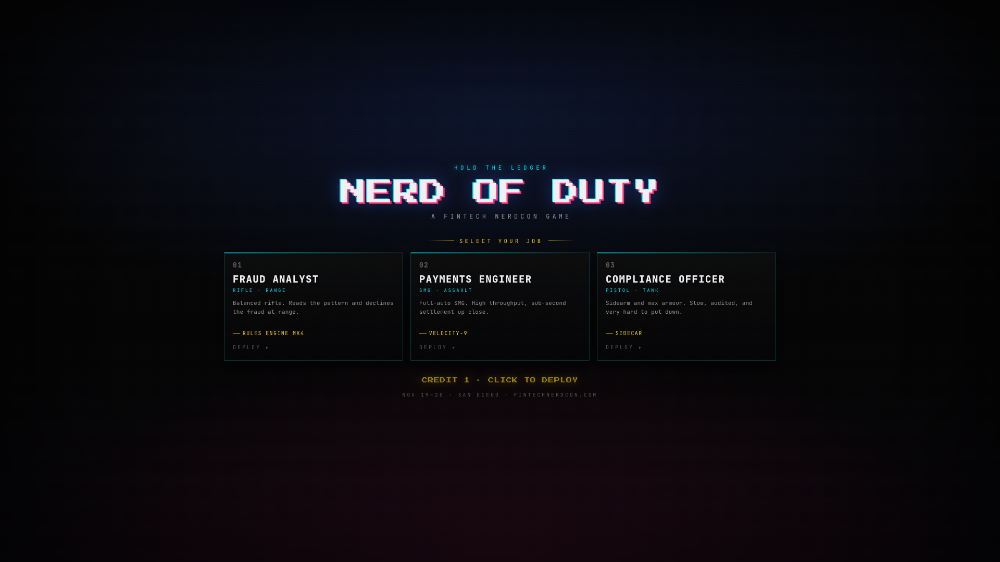

# NERD OF DUTY

**A FINTECH NERDCON GAME**



A browser FPS about defending fintech from the enemy it still hasn't beaten: the legacy core.

**Play it now: [nerd-of-duty.vercel.app](https://nerd-of-duty.vercel.app)** on desktop with a mouse. One click to deploy.

## HOLD THE LEDGER

The gold Ledger stands in the plaza. LEGACY CORE SECURITY, the private security force of Legacy Core Banking (est. 1959), wants it back. Waves escalate until you fall.

- Kills score `CARD DECLINED +100`, headshots `SAR FILED +150`, all through a chain multiplier that climbs to ×9 and only fully resets when you die.
- Clear a wave, bank the settle bonus, catch your breath for four seconds.
- Death means `INSUFFICIENT FUNDS`. You get one `FILE A DISPUTE — CONTINUE` per run. After that, the run is settled.
- Your best score and best wave persist locally. The game remembers what you did last quarter.



## Jobs

| Job | Loadout | Trade-off |
|---|---|---|
| **FRAUD ANALYST** | RULES ENGINE MK4 (rifle) | The all-rounder. Pattern recognition at 800 RPM. |
| **PAYMENTS ENGINEER** | VELOCITY-9 (SMG) | Fast, loud, occasionally sprays outside the spec. |
| **COMPLIANCE OFFICER** | SIDECAR (pistol) + max armour | One calibre, zero exceptions, hardest to kill. |

## Controls

| Input | Action |
|---|---|
| `W A S D` / arrows | Move |
| Mouse | Look · LMB fire · RMB aim |
| `Z` / `X` | Turn (trackpad-friendly) |
| `Shift` | Sprint |
| `Space` | Jump |
| `Ctrl` / `C` | Crouch |
| `B` | Prone |
| `Q` / `E` | Lean |
| `R` | Reload |
| `F` | Use |
| `G` | Grenade |
| `1` `2` `Tab` | Swap weapon |
| `Esc` | Release cursor |

## Under the hood

Nerd of Duty is a fork of [mshumer/Claude-of-Duty](https://github.com/mshumer/Claude-of-Duty) (MIT), a ~55k-line three.js FPS in which every asset is procedural. Geometry, textures, audio and animation are all generated at load time. There are no art files in this repo, and the only runtime dependency is `three`.

The NerdCon conversion kept the engine and added:

- `src/game/`: the HOLD THE LEDGER wave loop, scoring, and continue flow
- Arcade Terminal UI: the [Fintech NerdCon](https://fintechnerdcon.com) brand system as a HUD
- LEGACY CORE SECURITY: retextured enemy faction with killfeed callsigns (`COBOL`, `BATCH`, `FAX`, `T+2`…)
- Fintech world dressing: MT-103 CAFÉ, KYC BODEGA, STABLECOIN LIQUORS, and the Ledger monument
- A dusk blue-hour grade, because compliance deadlines land at end of day

The conversion itself was agent-built: contract-first fleets with single-owner subsystems, adversarial verifier passes, and a deterministic screenshot harness (`tools/capture.mjs`) gating every change. `ARCHITECTURE.md` and `NERDCON_CONTRACT.md` are the law the agents worked under.

## Development

```bash
npm install
npm run dev      # vite dev server on :5173
npm run build    # production build → dist/
npm run shot     # deterministic captures (tools/capture.mjs --list for shots)
```

Debug API in the console: `window.NOD` (`state`, `start(job)`, `skipToWave(n)`, `god(true)`, `killAll()`).

## Fintech NerdCon

**NOV 19–20 · SAN DIEGO · [FINTECHNERDCON.COM](https://fintechnerdcon.com)**

The conference for people who read bank rails documentation for fun. The game is the warm-up.

## License

MIT. Original engine and game by [Matt Shumer](https://github.com/mshumer). Thank you for open-sourcing something this good. NerdCon conversion by Fintech NerdCon.
